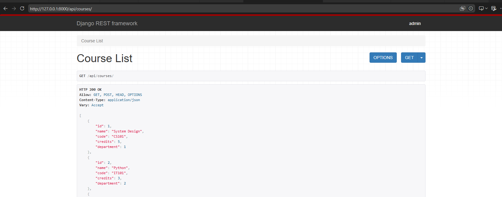
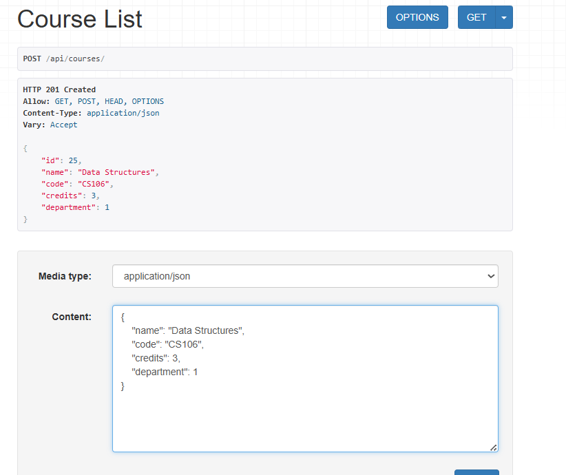
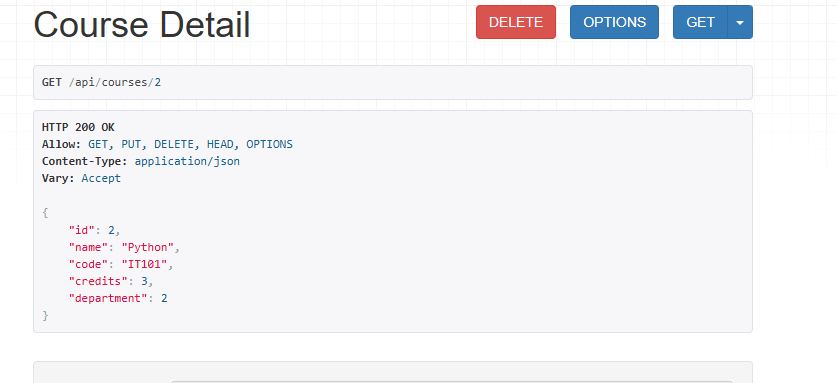
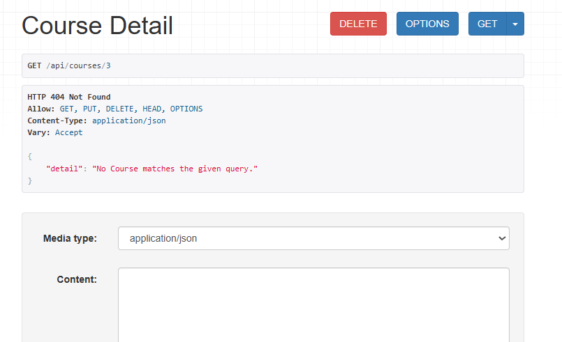
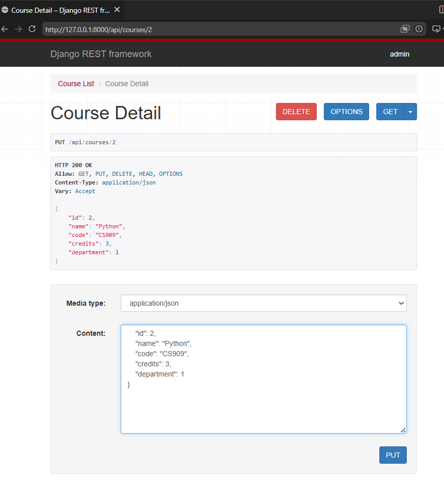
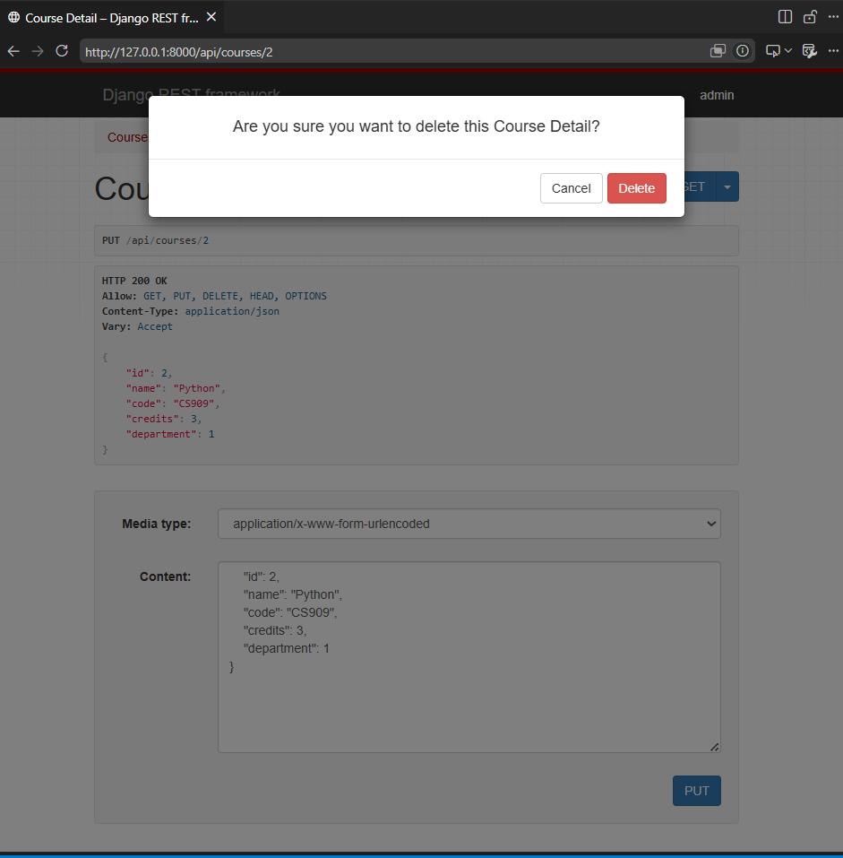
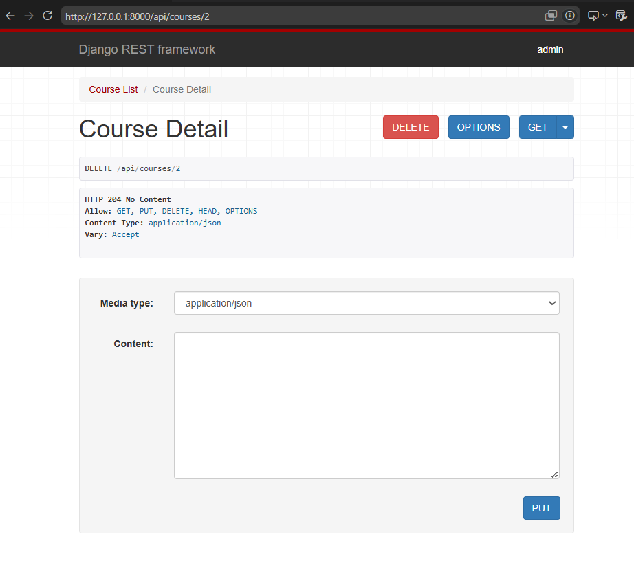

```
from rest_framework import serializers
from .models import Department,Course,Student,Enrollment

class DepartmentSerializer(serializers.ModelSerializer):
          class Meta:
                    model=Department
                    fields='__all__'

class CourseSerializer(serializers.ModelSerializer):
          class Meta:
                    model=Course
                    fields='__all__'
class StudentSerializer(serializers.ModelSerializer):
          class Meta:
                    model=Student
                    fields='__all__'

class EnrollmentSerializer(serializers.ModelSerializer):
          class Meta:
                    model=Enrollment
                    fields='__all__'
```







